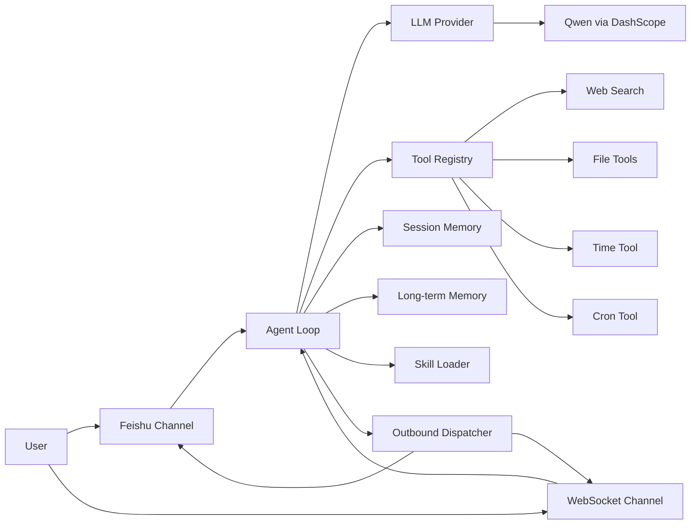

# EmbedClaw

[[中文]](./README_ZH.md)

<div align="center">

**Decouple LLM, Tools, Agent, and Channels—then pack them onto a single ESP32-S3.**

[](LICENSE)

</div>

> EmbedClaw is not just “a chatbot on an MCU.”  
> It’s an **Agent Runtime** on a microcontroller: messages enter via Channels, the Agent orchestrates, the LLM decides, Tools execute, Memory is persisted, Skills supply task-level knowledge, and results go back out through Channels.


## Origins

This project draws on the ideas and direction of:

- [OpenClaw](https://github.com/OpenClawAI/OpenClaw)
- [MimiClaw](https://github.com/memovai/mimiclaw)

EmbedClaw keeps the goal of running a full AI Agent on low-power hardware but focuses the architecture on **decoupling LLM, Tools, Agent, and Channels**.  
That means you can add new models, new channels, new tools, or new Skills without rewriting the rest of the system.

## Why EmbedClaw

### 1. Decoupled, not feature-bloated

The main idea is not “it can chat,” but that the parts that usually get tangled are separated:

- **Channel** only handles how messages are received and sent; it doesn’t care how the LLM reasons.
- **Agent** only handles task orchestration, context building, and the tool loop; it doesn’t care about transport.
- **LLM** only adapts model request/response; it doesn’t care whether the message came from Feishu or WebSocket.
- **Tools** only expose capabilities and JSON schema; they don’t care who calls them.
- **Skills** only describe tasks; they don’t depend on internal implementation.

That gives you:

- Easier addition of new chat entry points
- Lower cost to switch model providers
- Fast iteration on Tools and Skills
- Agent capabilities that can grow without collapsing the codebase

### 2. Not a one-off demo—a sustainable Agent core

The repo already has a full loop:

- Wi-Fi bring-up
- SPIFFS mount
- Channel registration and start
- Tool registration
- Skill install and load
- LLM init
- Agent loop running
- Memory / session persistence

It’s a working “embedded Agent base” you can extend.

## Implemented Features

### Core

| Module | Current implementation | Notes |
|--------|------------------------|--------|
| LLM | Qwen `qwen-plus` | Via Alibaba DashScope OpenAI-compatible API |
| Web Search | Tavily Search API | For news, weather, and real-time info |
| Chat Channel | Feishu, WebSocket | Feishu long connection in/out; local WebSocket chat |
| Agent | ReAct tool loop | Model can call tools, read results, then continue |
| Long-term memory | `/spiffs/memory/MEMORY.md` | User profile, preferences, stable facts |
| Short-term memory | `/spiffs/session/se_<hash>.jsonl` | Recent conversation for current session |
| Daily notes | `/spiffs/memory/<YYYY-MM-DD>.md` | Recent events and daily context |
| Skills | Built-in + SPIFFS | Task instructions as Markdown |
| Tools | Files, time, search, cron | Exposed to LLM via JSON schema |

### Registered tools

| Tool | Purpose |
|------|--------|
| `get_current_time` | Get current time and sync system clock |
| `web_search` | Web search via Tavily |
| `read_file` | Read files under `/spiffs` |
| `write_file` | Write or overwrite files under `/spiffs` |
| `edit_file` | Find/replace in `/spiffs` files |
| `list_dir` | List files under `/spiffs` |
| `cron_add` | Add periodic or one-shot scheduled tasks |
| `cron_list` | List scheduled tasks |
| `cron_remove` | Remove scheduled tasks |

### Built-in skills

These are installed at startup:

- `weather`
- `daily-briefing`
- `skill-creator`

You can add more Skills as Markdown under `/spiffs/skills/*.md`; the Agent picks them up from the system prompt.

## Architecture



## Directory layout

```text
.
├── main/                         # App entry, Wi-Fi init
├── components/embed_claw/
│   ├── core/                     # Agent, Memory, Session, Skill Loader, Tool Registry
│   ├── llm/                      # LLM provider abstraction and implementations
│   ├── tools/                    # Tool implementations
│   ├── channel/                 # Feishu / WebSocket channels
│   ├── embed_claw.c             # System startup entry
│   └── ec_config.h              # Build-time configuration
├── spiffs_data/                  # Default SPIFFS image content
└── scripts/                     # WebSocket test and Feishu relay scripts
```

## Runtime flow

After boot, the flow is:

1. `main/main.c` inits NVS, SPIFFS, Wi-Fi.
2. `ec_embed_claw_start()` registers channels, tools, skills, and inits the LLM.
3. The Agent loop blocks on inbound messages.
4. Channels turn incoming data into `ec_msg_t`.
5. The Agent loads short-term history, long-term memory, recent notes, and skill summaries into the system prompt.
6. The LLM decides to reply or call tools.
7. Tools run and results are fed back to the LLM.
8. Final text goes to the outbound queue.
9. The outbound task sends replies back through the right channel.

## Storage layout

EmbedClaw uses SPIFFS for persona, user info, sessions, and memory:

| Path | Purpose |
|------|--------|
| `/spiffs/config/SOUL.md` | Assistant persona and style |
| `/spiffs/config/USER.md` | Static user info |
| `/spiffs/memory/MEMORY.md` | Long-term memory |
| `/spiffs/memory/<YYYY-MM-DD>.md` | Daily notes |
| `/spiffs/session/se_<hash>.jsonl` | Session history |
| `/spiffs/skills/*.md` | Skill files |
| `/spiffs/cron.json` | Cron snapshot |

Notes:

- Session history keeps the last **20** messages by default.
- The system prompt is built from long-term memory, last 3 days of notes, and skill summaries.
- `cron.json` is written to SPIFFS but cron state is not fully restored on reboot yet.

## Quick start

### Hardware and environment

You’ll need:

- An **ESP32-S3** dev board
- **16 MB Flash** (default partition layout assumes 16 MB)
- **PSRAM** (enabled by default in this project)
- USB cable
- **ESP-IDF 5.x** installed

The default target is `esp32s3`. The build packs `spiffs_data/` with `spiffs_create_partition_image`.

### 1. Configure keys and platform

Configuration is build-time, mainly in:

- [`components/embed_claw/ec_config.h`](components/embed_claw/ec_config.h)

Set at least:

```c
#define EC_SECRET_SEARCH_KEY        "YOUR_TAVILY_API_KEY"
#define EC_LLM_API_KEY              "YOUR_DASHSCOPE_API_KEY"
#define EC_LLM_MODEL                "qwen-plus"
#define EC_SECRET_FEISHU_APP_ID     "YOUR_FEISHU_APP_ID"
#define EC_SECRET_FEISHU_APP_SECRET "YOUR_FEISHU_APP_SECRET"
```

Default LLM URL (DashScope OpenAI-compatible):

```c
#define EC_LLM_API_URL "https://dashscope-intl.aliyuncs.com/compatible-mode/v1/chat/completions"
```

If you skip Tavily or Feishu for now, you only need the Qwen-related keys.

### 2. Build

```bash
idf.py set-target esp32s3
idf.py build
```

### 3. Flash and monitor

```bash
idf.py -p /dev/ttyACM0 flash monitor
```

On macOS the serial port is often:

```bash
/dev/cu.usbmodemXXXX
```

### 4. First-time Wi-Fi

`main/wifi_connect.cpp` behavior:

- If Wi-Fi was saved before, it tries STA and connects.
- If not, it starts a provisioning AP.

AP SSID prefix:

```c
#define EMBED_WIFI_SSID_PREFIX "ESP32"
```

In provisioning mode, connect to the device’s AP and open:

```text
http://192.168.4.1
```

After configuring Wi-Fi, the device switches back to normal STA mode.

## WebSocket chat

WebSocket is the most direct way to talk to EmbedClaw and is ideal for debugging.

### Server

- Port: **18789**
- Path: **/**
- Protocol: WebSocket text frames

### Quick test

Use the provided script:

- [`scripts/test_ws_client.py`](scripts/test_ws_client.py)

Install dependency:

```bash
pip install websocket-client
```

Connect to the device:

```bash
python scripts/test_ws_client.py <DEVICE_IP> 18789
```

Example:

```bash
python scripts/test_ws_client.py 192.168.31.88 18789
```

### Inbound message format

Simple message:

```json
{
  "type": "message",
  "content": "Search for today's tech news"
}
```

With custom `chat_id`:

```json
{
  "type": "message",
  "content": "Remember I like mechanical keyboards",
  "chat_id": "my-debug-session"
}
```

To simulate Feishu from a relay:

```json
{
  "type": "message",
  "content": "Set a reminder for 8am tomorrow",
  "channel": "feishu",
  "chat_id": "open_id:ou_xxx"
}
```

### Outbound message format

Device response:

```json
{
  "type": "response",
  "content": "Here’s today’s tech news summary.",
  "chat_id": "my-debug-session"
}
```

## Feishu (Lark) integration

EmbedClaw includes a Feishu channel that **initiates a long-lived connection to Feishu** to receive messages. No public IP or Webhook URL is required.

### What the Feishu channel does

1. Uses App ID / App Secret to get `tenant_access_token`
2. Calls `https://open.feishu.cn/callback/ws/endpoint` for the WebSocket URL
3. Connects to Feishu over WebSocket
4. Subscribes to and handles `im.message.receive_v1`
5. Pushes text messages into the Agent
6. Sends replies via `POST /open-apis/im/v1/messages`

### Setup

#### 1. Create a Feishu app

Create an enterprise app in the [Feishu open platform](https://open.feishu.cn) and note:

- App ID  
- App Secret  

#### 2. Enable message permissions

Enable at least “receive messages” and “send messages,” and ensure the bot can be used in your tenant. Exact permission names may vary in the console.

#### 3. Event subscription

Under “Event subscription”:

- Choose **Use long connection to receive events**
- Subscribe to **im.message.receive_v1**

#### 4. Put credentials in the project

Edit [`components/embed_claw/ec_config.h`](components/embed_claw/ec_config.h):

```c
#define EC_SECRET_FEISHU_APP_ID     "cli_xxx"
#define EC_SECRET_FEISHU_APP_SECRET "xxxx"
```

#### 5. Build, flash, and connect

Once the device is online, the Feishu channel starts and connects to Feishu.

#### 6. Chat

- DM the bot, or
- Add the bot to a group and chat there.

Reply target is chosen automatically:

- DMs: `open_id:<id>`
- Groups: `chat_id:<id>`

### Optional: PC relay script

The repo includes [`scripts/feishu_relay.py`](scripts/feishu_relay.py) for:

- Testing the Feishu event flow on a PC
- Bridging Feishu messages to the device WebSocket
- Debugging Feishu and the device Agent separately

For normal use, the built-in Feishu long-connection implementation is recommended.

## Persona and memory

These files are preloaded in SPIFFS:

- [`spiffs_data/config/SOUL.md`](spiffs_data/config/SOUL.md)
- [`spiffs_data/config/USER.md`](spiffs_data/config/USER.md)
- [`spiffs_data/memory/MEMORY.md`](spiffs_data/memory/MEMORY.md)

Roles:

- **SOUL.md**: Who the assistant is and how it speaks
- **USER.md**: User profile
- **MEMORY.md**: Long-term knowledge

Each turn, the Agent builds the system prompt from:

- Personality  
- User info  
- Long-term memory  
- Recent notes  
- Available skills  
- Current turn context  

That’s how it keeps continuity and “memory” across turns.

## Extending the system

The repo is structured so you can extend it without rewriting core logic.

### Adding a tool

1. Add `tools_xxx.c` under `components/embed_claw/tools/`
2. Define an `ec_tools_t` with `name`, `description`, `input_schema_json`, and `execute`
3. Expose a register function, e.g. `esp_err_t ec_tools_xxx(void);`
4. Add `EC_TOOLS_REG(xxx)` in `components/embed_claw/tools/ec_tools_reg.inc`

Minimal skeleton:

```c
static esp_err_t ec_tool_demo_execute(const char *input_json, char *output, size_t output_size);

static const ec_tools_t s_demo = {
    .name = "demo_tool",
    .description = "Describe what this tool does.",
    .input_schema_json =
        "{\"type\":\"object\",\"properties\":{},\"required\":[]}",
    .execute = ec_tool_demo_execute,
};

esp_err_t ec_tools_demo(void)
{
    ec_tools_register(&s_demo);
    return ESP_OK;
}
```

### Adding a skill

Skills are Markdown task descriptions, not code. You can:

- Write them at runtime via tools to `/spiffs/skills/<name>.md`
- Or put default skills in `spiffs_data/skills/` so they’re in the SPIFFS image
- Or add built-in skills in `ec_skill_loader.c`

Suggested format:

```md
# Translate

Translate text between languages.

## When to use
When the user asks for translation.

## How to use
1. Detect source and target language.
2. Translate directly.
3. If terminology is important, verify with web_search.
```

### Adding a channel

1. Add `ec_channel_xxx.c` under `components/embed_claw/channel/`
2. Implement `start()` and `send()`
3. Convert incoming messages to `ec_msg_t` and call `ec_agent_inbound()`
4. On outbound, route by `msg->chat_id`
5. Register with `EC_CHANNEL_REG(xxx)` in `ec_channel_reg.inc`

Minimal skeleton:

```c
static esp_err_t ec_channel_demo_start(void);
static esp_err_t ec_channel_demo_send(const ec_msg_t *msg);

static const ec_channel_t s_driver = {
    .name = "demo",
    .vtable = {
        .start = ec_channel_demo_start,
        .send = ec_channel_demo_send,
    },
};

esp_err_t ec_channel_demo(void)
{
    return ec_channel_register(&s_driver);
}
```

### Adding an LLM provider

Currently used:

- **LLM_TYPE_OPENAI**
- DashScope OpenAI-compatible API
- **qwen-plus**

To add another provider:

1. See `components/embed_claw/llm/ec_llm_internal.h`
2. Add `ec_llm_xxx.c` / `.h`
3. Implement `init` and `chat_tools`
4. Map the provider’s response to `ec_llm_response_t`
5. Wire the new type in `ec_llm.c` and select it at startup

The repo already has a stub for Anthropic; the working path is OpenAI-compatible (OpenAI, DeepSeek, Moonshot, Qwen, etc.).

## Possible next steps

With clear boundaries, natural extensions include:[TODE.md](TODO.md)

## Notes

### 1. Build-time configuration

For open-source distribution, default keys in the repo are empty. Before running, set:

- DashScope / Qwen API key  
- Tavily API key  
- Feishu App ID and App Secret  

### 2. Best use today

This repo is a good fit for:

- Experimenting with an embedded AI Agent framework
- Building Feishu- or WebSocket-driven edge assistants
- Validating tool calling, memory, and skills on real hardware
- Using it as a base for productization

## License

This project is open source under the [MIT License](LICENSE).

You may use, modify, distribute, and use commercially, subject to retaining the original copyright and license notice.
