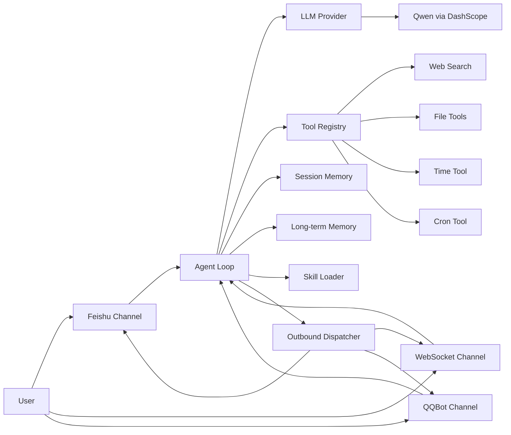

# EmbedClaw

[[English]](./README.md)

<div align="center">

**把 LLM、Tools、Agent、Channel 彻底拆开，再把它们装进一块 ESP32-S3。**

[](LICENSE)     

</div>

> EmbedClaw 不是“把聊天机器人塞进单片机”这么简单。  
> 它更像是一套运行在 MCU 上的 Agent Runtime：消息从 Channel 进入，Agent 负责编排，LLM 决策，Tools 执行，Memory 落盘，Skills 提供任务级知识，最后再从 Channel 返回结果。

## 项目缘起

本仓库在理念和方向上参考了以下优秀项目：

- [OpenClaw](https://github.com/OpenClawAI/OpenClaw)
- [MimiClaw](https://github.com/memovai/mimiclaw)

EmbedClaw 延续了“在低功耗硬件上运行完整 AI Agent”的思路，但把架构重点放在了 **LLM、Tools、Agent、Channel 的解耦** 上。  
这意味着后续无论你要扩展新的模型、接入新的通信渠道、增加新的工具，还是为特定任务设计新的 Skill，都不需要推倒重来。

## 为什么是 EmbedClaw

### 1. 解耦，而不是堆功能

这套系统最核心的特色，不是“能聊天”，而是它把几个最容易纠缠在一起的模块拆开了：

- `Channel` 只关心消息如何收、如何发，不关心 LLM 怎么推理
- `Agent` 只关心任务编排、上下文构建、Tool Loop，不关心底层传输协议
- `LLM` 只关心模型请求/响应的适配，不关心消息来自飞书还是 WebSocket
- `Tools` 只关心能力暴露与 JSON Schema，不关心谁调用它
- `Skills` 只关心任务说明书，不关心系统内部实现

这种拆分方式带来的价值非常直接：

- 后续接新的聊天入口更轻松
- 更换模型供应商成本更低
- Tool 和 Skill 可以快速演进
- Agent 能力可以持续堆叠，但不会把代码结构拖垮

### 2. 不是纯 Demo，而是可持续扩展的 Agent 内核

当前仓库已经具备一条完整闭环：

- Wi-Fi 启动
- SPIFFS 挂载
- Channel 注册与启动
- Tool 注册
- Skill 安装与加载
- LLM 初始化
- Agent Loop 运行
- Memory / Session 持久化

它已经不是单点能力展示，而是一套可继续生长的“嵌入式 Agent 基座”。

## 已实现能力总览

### 核心能力

| 模块 | 当前实现 | 说明 |
| --- | --- | --- |
| LLM | 千问 `qwen-plus` | 通过阿里云 DashScope 的 OpenAI-Compatible 接口调用 |
| Web Search | Tavily Search API | 用于新闻、天气、最新资料等实时信息检索 |
| Chat Channel | Feishu、WebSocket、QQBot | 飞书长连接、本地 WebSocket 对话、官方 QQBot gateway |
| Agent | ReAct Tool Loop | 支持模型调用工具、再读工具结果、再继续推理 |
| 长期记忆 | `/spiffs/memory/MEMORY.md` | 用户画像、长期偏好、稳定事实 |
| 短期记忆 | `/spiffs/session/se_<hash>.jsonl` | 最近对话历史，供当前会话上下文使用 |
| 每日笔记 | `/spiffs/memory/<YYYY-MM-DD>.md` | 记录近期事件与每日上下文 |
| Skills | 内置 + SPIFFS 动态技能 | 任务指令可持久化为 Markdown |
| Tools | 文件、时间、搜索、定时任务 | 通过统一 JSON Schema 暴露给 LLM |

### 已注册 Tools

| Tool | 作用 |
| --- | --- |
| `get_current_time` | 获取当前时间，并同步系统时间 |
| `web_search` | 通过 Tavily 进行网页搜索 |
| `read_file` | 读取 `/spiffs` 下文件 |
| `write_file` | 写入或覆盖 `/spiffs` 下文件 |
| `edit_file` | 对 `/spiffs` 下文件进行查找替换 |
| `list_dir` | 枚举 `/spiffs` 下文件 |
| `cron_add` | 创建周期任务或单次任务 |
| `cron_list` | 查看当前定时任务 |
| `cron_remove` | 删除定时任务 |

### 已启用 Skills

系统启动时会自动安装内置 Skills：

- `weather`
- `daily-briefing`
- `skill-creator`

同时，也支持把新的 Skill 作为 Markdown 文件写入 `/spiffs/skills/*.md`，由 Agent 在系统提示词中发现并按需加载。

## 架构图



## 目录结构

```text
.
├── main/                         # 启动入口、Wi-Fi 初始化
├── components/embed_claw/
│   ├── core/                     # Agent、Memory、Session、Skill Loader、Tool Registry
│   ├── llm/                      # LLM Provider 抽象与具体实现
│   ├── tools/                    # Tools 实现
│   ├── channel/                  # Feishu / WebSocket / QQBot 通道实现
│   ├── embed_claw.c              # 系统统一启动入口
│   └── ec_config_internal.h      # 仓库内置默认配置，项目覆盖放在 main/ec_config.h
├── spiffs_data/                  # 默认写入 SPIFFS 的系统文件
└── scripts/                      # WebSocket 测试脚本与测试构建辅助脚本
```

## 运行流程

系统启动后，大致按下面的顺序运行：

1. `main/main.c` 初始化 NVS、SPIFFS、Wi-Fi
2. `ec_embed_claw_start()` 注册 Channel / Tool / Skill，并初始化 LLM
3. `Agent Loop` 阻塞等待入站消息
4. `Channel` 把消息转成统一的 `ec_msg_t`
5. `Agent` 读取短期历史、长期记忆、最近笔记、Skill 摘要，构建系统提示词
6. `LLM` 决定直接回答或发起 Tool Call
7. `Tools` 执行后把结果回灌给 LLM
8. 最终文本回复进入出站队列
9. 出站调度任务把回复发送回对应 Channel

## 存储布局

EmbedClaw 使用 SPIFFS 保存人格、用户信息、会话与记忆：

| 路径 | 用途 |
| --- | --- |
| `/spiffs/config/SOUL.md` | 助手人格与行为风格 |
| `/spiffs/config/USER.md` | 用户静态信息 |
| `/spiffs/memory/MEMORY.md` | 长期记忆 |
| `/spiffs/memory/<YYYY-MM-DD>.md` | 每日记录 |
| `/spiffs/session/se_<hash>.jsonl` | 短期会话历史 |
| `/spiffs/skills/*.md` | Skill 文件 |
| `/spiffs/cron.json` | 定时任务快照 |

说明：

- 当前会话历史默认保留最近 `20` 条消息
- 系统提示词会自动拼接长期记忆、近 3 天笔记、Skill 摘要
- `cron.json` 当前会写入 SPIFFS，但现阶段尚未在重启后自动恢复全部任务状态

## 快速开始

### 硬件与环境

建议准备：

- 一块 `ESP32-S3` 开发板
- `16MB Flash`（项目默认分区已按 16MB 配置）
- `PSRAM`（当前工程默认启用）
- USB 数据线
- 已安装好的 `ESP-IDF 5.x`
- 推荐版本：`ESP-IDF v5.5.2`（当前主要验证基线）

工程默认目标芯片为 `esp32s3`，并通过 `spiffs_create_partition_image` 在构建时打包 `spiffs_data/`。

### 1. 配置密钥与平台参数

当前版本的编译期配置分两层：

- [`components/embed_claw/ec_config_internal.h`](components/embed_claw/ec_config_internal.h) 提供仓库内默认值和空白密钥占位。
- 如需放项目自己的参数或敏感信息，请新建本地 [`main/ec_config.h`](main/ec_config.h)，只定义你要覆盖的宏。构建系统会把这个头自动注入 `embed_claw`，因此不必把密钥写回共享组件目录。

如不存在可先创建 `main/ec_config.h`，你至少需要填写：

```c
#define EC_SECRET_SEARCH_KEY        "YOUR_TAVILY_API_KEY"
#define EC_LLM_API_KEY              "YOUR_DASHSCOPE_API_KEY"
#define EC_LLM_MODEL                "qwen-plus"
#define EC_SECRET_FEISHU_APP_ID     "YOUR_FEISHU_APP_ID"
#define EC_SECRET_FEISHU_APP_SECRET "YOUR_FEISHU_APP_SECRET"
```

默认的 LLM 地址已经指向 DashScope OpenAI-Compatible 接口：

```c
#define EC_LLM_API_URL "https://dashscope-intl.aliyuncs.com/compatible-mode/v1/chat/completions"
```

如果你暂时不用 Tavily 或飞书，可以只配置 Qwen 所需参数。

可选的 channel 开关示例：

```c
#define EC_FEISHU_ENABLE     0
#define EC_QQ_ENABLE         1
#define EC_QQ_APP_ID         "YOUR_QQ_APP_ID"
#define EC_QQ_CLIENT_SECRET  "YOUR_QQ_CLIENT_SECRET"
```

当前仓库里的 QQ 走官方 QQBot 接入路线：`AppID + ClientSecret -> access_token -> /gateway -> websocket`。设备本身作为客户端主动连接，不需要设备提供公网 IP。

### 2. 编译

编译前先同步一份 `esp32s3` 的默认配置到 `sdkconfig.defaults`，这样后续进入 `menuconfig` 时会带上当前仓库针对 `esp32s3` 预设的默认项：

```bash
cp sdkconfig.defaults.esp32s3 sdkconfig.defaults
idf.py set-target esp32s3
idf.py build
```

### 3. 烧录与串口监视

```bash
idf.py -p /dev/ttyACM0 flash monitor
```

如果你在 macOS 上，串口通常类似：

```bash
/dev/cu.usbmodemXXXX
```

### 4. 首次联网

`main/wifi_connect.cpp` 的逻辑是：

- 如果已经保存过 Wi-Fi，直接尝试 STA 联网
- 如果没有保存过 Wi-Fi，启动配网 AP

默认 AP SSID 前缀来自：

```c
#define EMBED_WIFI_SSID_PREFIX "ESP32"
```

当设备进入配网模式时，可连接设备热点，并访问：

```text
http://192.168.4.1
```

完成 Wi-Fi 配置后，设备会切回正常联网模式。

## WebSocket 对话

WebSocket 是 EmbedClaw 最直接、最适合调试的聊天入口。

### 服务端信息

- 端口：`18789`
- 路径：`/`
- 协议：WebSocket Text Frame

### 最简单的测试方式

仓库已提供测试脚本：

- [`scripts/test_ws_client.py`](scripts/test_ws_client.py)

安装依赖：

```bash
pip install websocket-client
```

连接设备：

```bash
python scripts/test_ws_client.py <DEVICE_IP> 18789
```

例如：

```bash
python scripts/test_ws_client.py 192.168.31.88 18789
```

### WebSocket 入站消息格式

普通消息：

```json
{
  "type": "message",
  "content": "你好，帮我搜索一下今天的科技新闻"
}
```

带自定义 `chat_id` 的消息：

```json
{
  "type": "message",
  "content": "记住我喜欢机械键盘",
  "chat_id": "my-debug-session"
}
```

如果你通过外部桥接层把消息伪装成飞书来源，也可以传：

```json
{
  "type": "message",
  "content": "帮我设一个明天早上八点的提醒",
  "channel": "feishu",
  "chat_type": "open_id",
  "chat_id": "ou_xxx"
}
```

### WebSocket 出站消息格式

设备返回：

```json
{
  "type": "response",
  "content": "已经为你整理好了今天的科技新闻摘要。",
  "chat_id": "my-debug-session",
  "chat_type": "ws"
}
```

`chat_type` 会出现在出站响应中，并随当前会话/入站路由上下文透传。

## 飞书接入与对话

EmbedClaw 当前已经内置飞书 Channel，且采用 **设备主动向飞书建立长连接** 的方式接收消息。  
这意味着它不是传统 Webhook 模式，不要求设备有公网 IP。

### 飞书通道做了什么

飞书通道会自动完成以下流程：

1. 用 `App ID / App Secret` 获取 `tenant_access_token`
2. 向 `https://open.feishu.cn/callback/ws/endpoint` 申请长连接地址
3. 通过 WebSocket 与飞书建立长连接
4. 订阅并处理 `im.message.receive_v1`
5. 将收到的文本消息推入 Agent
6. 使用 `POST /open-apis/im/v1/messages` 把回复发回飞书会话

### 接入步骤

#### 1. 创建飞书应用

前往飞书开放平台创建企业自建应用，并记录：

- `App ID`
- `App Secret`

#### 2. 开通消息相关权限

请在应用权限中至少开通“消息接收 / 消息发送”相关能力，并确保机器人可在企业内被使用。  
飞书后台权限命名可能会调整，实操时以“能够接收消息事件、能够向用户/群发送消息”为准。

#### 3. 配置事件订阅

在“事件订阅”中选择：

- `使用长连接接收事件`

并订阅事件：

- `im.message.receive_v1`

#### 4. 把凭证写入工程

新建或编辑：

- [`main/ec_config.h`](main/ec_config.h)

填写：

```c
#define EC_SECRET_FEISHU_APP_ID     "cli_xxx"
#define EC_SECRET_FEISHU_APP_SECRET "xxxx"
```

#### 5. 编译烧录并联网

设备联网后，飞书通道会自动启动并尝试连接飞书长连接服务。

#### 6. 开始对话

你可以：

- 单聊机器人
- 把机器人拉进群，在群里与其交互

当前实现会自动区分回复目标：

- 单聊：`chat_type="open_id"`，`chat_id="<open_id>"`
- 群聊：`chat_type="chat_id"`，`chat_id="<chat_id>"`

因此你不需要自己维护会话路由。

### 可选：使用 PC 中继脚本

仓库还提供了一个可选脚本：

- [`scripts/feishu_relay.py`](scripts/feishu_relay.py)

这个脚本适合以下场景：

- 你想在电脑上先验证飞书事件流
- 你想把飞书消息桥接到设备的 WebSocket 接口
- 你需要在调试期临时把“飞书接入”和“设备端 Agent”拆开

但对当前仓库来说，**推荐优先使用内置飞书长连接实现**，因为代码里已经实现了设备直连飞书。

## QQBot 接入

EmbedClaw 当前也内置了 QQ channel，并且采用的是官方 QQBot / OpenClaw 插件同一路线，不再走 OneBot 桥接。

### QQ 通道做了什么

1. 使用 `EC_QQ_APP_ID` 和 `EC_QQ_CLIENT_SECRET`
2. 请求 `https://bots.qq.com/app/getAppAccessToken`
3. 请求 `https://api.sgroup.qq.com/gateway`
4. 通过 WebSocket 建立 QQ gateway 长连接
5. 发送 `IDENTIFY`，维持 heartbeat，接收 dispatch event
6. 通过官方 REST API 把回复发回 QQ

### 当前已支持的入站事件

- `C2C_MESSAGE_CREATE`
- `GROUP_AT_MESSAGE_CREATE`
- `AT_MESSAGE_CREATE`

在 EmbedClaw 内部会映射为路由字段：

- C2C：`chat_type="c2c"`，`chat_id="<openid>"`
- 群聊：`chat_type="group"`，`chat_id="<group_openid>"`
- 频道：`chat_type="channel"`，`chat_id="<channel_id>"`

### 最小配置

在 [`main/ec_config.h`](main/ec_config.h) 里增加：

```c
#define EC_QQ_ENABLE        1
#define EC_QQ_APP_ID        "YOUR_QQ_APP_ID"
#define EC_QQ_CLIENT_SECRET "YOUR_QQ_CLIENT_SECRET"
```

可选配置：

```c
#define EC_QQ_INTENTS      (1 << 25)
#define EC_QQ_RECONNECT_MS 10000
```

### 说明

- 当前版本先聚焦文本消息闭环
- 设备不暴露 Webhook 回调地址
- 如果 QQ 凭证或权限有问题，启动日志会直接打印 token / gateway / websocket 哪一步失败

官方入口：
<https://q.qq.com/qqbot/openclaw/index.html>

## 测试说明

当前仓库有两层测试入口：

- 主工程固件编译检查：`idf.py build`
- `embed_claw` 单测镜像编译检查：`./scripts/run_unit_tests.sh build`

板上测试、串口自动采集、目录结构说明见：

- [`components/embed_claw/test/README.md`](components/embed_claw/test/README.md)

GitHub Actions 目前只做“主工程能编”和“unit-test-app 能编”，不在 CI 上连接真机跑硬件测试。

## 当前默认人格与记忆机制

系统在 SPIFFS 中预置了以下文件：

- [`spiffs_data/config/SOUL.md`](spiffs_data/config/SOUL.md)
- [`spiffs_data/config/USER.md`](spiffs_data/config/USER.md)
- [`spiffs_data/memory/MEMORY.md`](spiffs_data/memory/MEMORY.md)

它们分别承担：

- `SOUL.md`：定义助手是谁、怎么说话、偏好什么风格
- `USER.md`：保存用户画像
- `MEMORY.md`：沉淀长期知识

Agent 在每轮对话里会自动拼装：

- Personality
- User Info
- Long-term Memory
- Recent Notes
- Available Skills
- Current Turn Context

这就是它能逐步“长出记忆感”和“任务连续性”的原因。

## 为什么说它更适合继续开发

因为这个仓库目前真正有价值的，是它已经把扩展接口留好了。

### Tool 扩展

新增 Tool 的标准方式：

1. 在 `components/embed_claw/tools/` 下新建 `tools_xxx.c`
2. 定义一个 `ec_tools_t`
3. 填写：
   - `name`
   - `description`
   - `input_schema_json`
   - `execute`
4. 暴露一个注册函数，例如 `esp_err_t ec_tools_xxx(void);`
5. 在 `components/embed_claw/tools/ec_tools_reg.inc` 里增加 `EC_TOOLS_REG(xxx)`

最小骨架如下：

```c
static esp_err_t ec_tool_demo_execute(const char *input_json, char *output, size_t output_size);

static const ec_tools_t s_demo = {
    .name = "demo_tool",
    .description = "Describe what this tool does.",
    .input_schema_json =
        "{\"type\":\"object\",\"properties\":{},\"required\":[]}",
    .execute = ec_tool_demo_execute,
};

esp_err_t ec_tools_demo(void)
{
    ec_tools_register(&s_demo);
    return ESP_OK;
}
```

### Skill 扩展

Skill 是最轻量的扩展方式。它不是代码，而是任务说明书。

你可以：

- 在运行时通过 Tool 把 Skill 写入 `/spiffs/skills/<name>.md`
- 或者把默认 Skill 放进 `spiffs_data/skills/`，随 SPIFFS 镜像一同烧录
- 或者在 `ec_skill_loader.c` 中增加新的内置 Skill

建议格式：

```md
# Translate

Translate text between languages.

## When to use
When the user asks for translation.

## How to use
1. Detect source and target language.
2. Translate directly.
3. If terminology is important, verify with web_search.
```

### Channel 扩展

新增 Channel 的标准方式：

1. 在 `components/embed_claw/channel/` 下新建 `ec_channel_xxx.c`
2. 实现 `start()` 与 `send()`
3. 收到外部消息时，转成统一 `ec_msg_t`，再调用 `ec_agent_inbound()`
4. 在出站时先按 `msg->channel` 选择 channel driver
5. 在各 channel 的 `send()` 中，使用 `msg->chat_type` + `msg->chat_id` 解析目标
6. 在 `components/embed_claw/channel/ec_channel_reg.inc` 中增加 `EC_CHANNEL_REG(xxx)`

最小骨架：

```c
static esp_err_t ec_channel_demo_start(void);
static esp_err_t ec_channel_demo_send(const ec_msg_t *msg);

static const ec_channel_t s_driver = {
    .name = "demo",
    .vtable = {
        .start = ec_channel_demo_start,
        .send = ec_channel_demo_send,
    },
};

esp_err_t ec_channel_demo(void)
{
    return ec_channel_register(&s_driver);
}
```

### LLM 扩展

当前默认实际启用的是：

- `EC_LLM_PROVIDER_NAME`（默认：`openai`）
- DashScope OpenAI-Compatible 接口
- `qwen-plus`

但抽象层已经拆出来了，扩展新 Provider 的路径很清晰：

1. 参考 `components/embed_claw/llm/ec_llm_internal.h`
2. 新建 `ec_llm_xxx.c/.h`
3. 在新 Provider 模块导出 `ec_llm_xxx_get_provider(void)`
4. 实现 Provider 的 `init`、`chat_tools`，并把响应解析为统一的 `ec_llm_response_t`
5. 在 `ec_llm.c` 的 `ec_llm_init_default()` 中加一条 provider 名称到 getter 的映射分支
6. 在 `main/ec_config.h` 里设置 `EC_LLM_PROVIDER_NAME`（并配套 URL / model）

补充说明：

- 但现阶段真正跑通的是 OpenAI-Compatible 路径
- 所以如果你要接 OpenAI、DeepSeek、Moonshot、通义千问兼容接口，成本会最低

## 适合继续演进的方向

因为系统边界已经拆开，后续比较自然的演进方向参考:[TODO_ZH.md](TODO_ZH.md)

## 注意事项

### 1. 当前仓库默认是“编译期配置”

为方便开源发布，仓库里的默认密钥已清空。真实密钥建议写在本地 `main/ec_config.h`，而不是直接修改 `components/embed_claw/ec_config_internal.h`。`main/ec_config.h` 默认已被 Git 忽略。  

在正式运行前，请先填写：

- DashScope / Qwen API Key
- `EC_LLM_PROVIDER_NAME`（默认是 `openai`）
- Tavily API Key
- Feishu App ID / Secret

### 2. 当前更适合做什么

这个仓库现在最适合：

- 做嵌入式 AI Agent 框架实验
- 做飞书 / WebSocket 驱动的边缘助手
- 做 Tool Calling / Memory / Skill 的工程化验证
- 做后续产品化架构底座

## License

本项目采用 [MIT License](LICENSE) 开源。

你可以自由地使用、修改、分发、商用，但请保留原始版权与许可声明。
